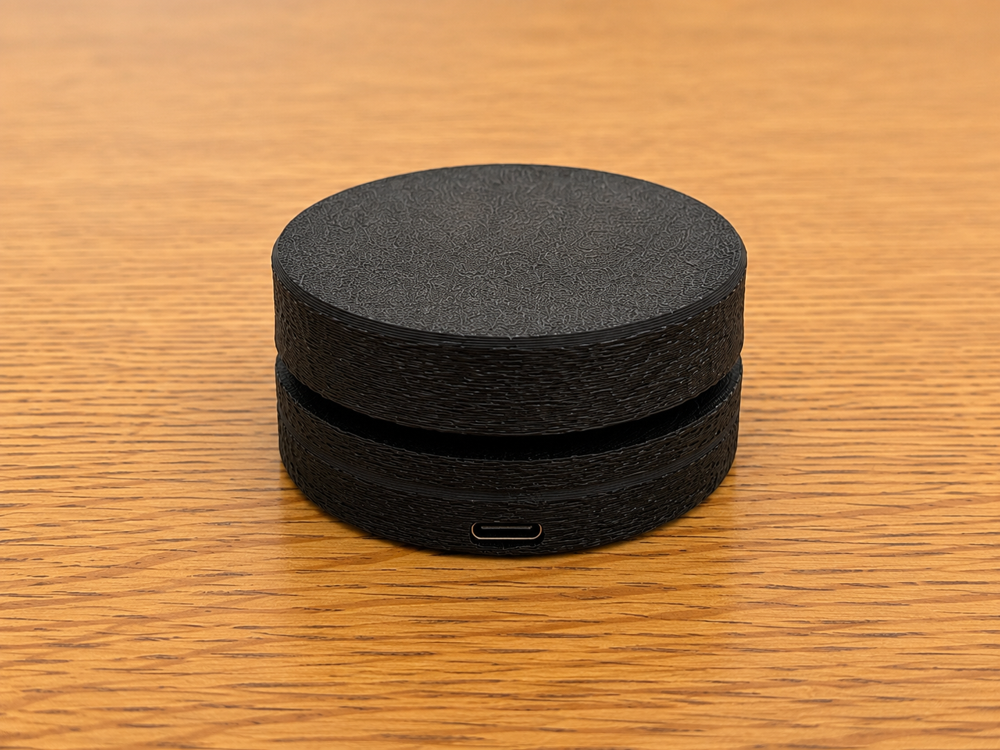
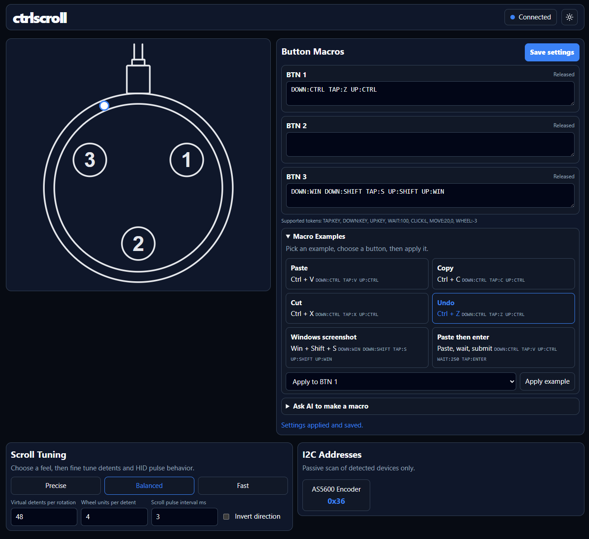
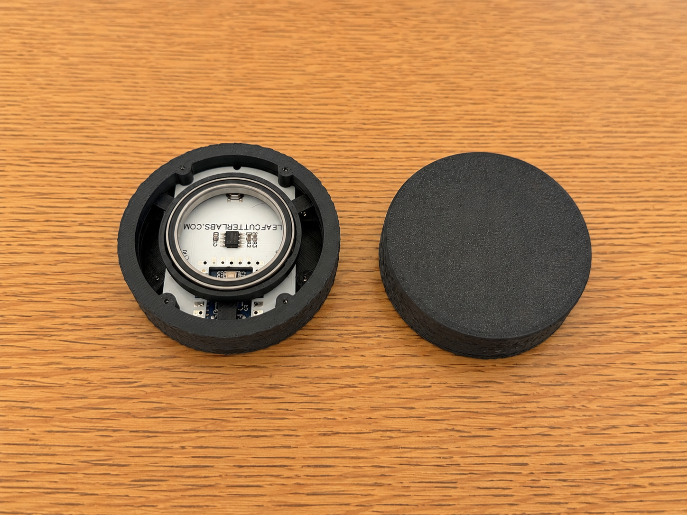

# ctrlscroll

> **A programmable desktop scroll controller with configurable detents, programmable macros, and a browser-based setup experience.**

High-resolution magnetic encoder • Three programmable buttons • USB-C • RP2040 • Browser-based configuration • Open Source

---

## What is ctrlscroll?

ctrlscroll is a dedicated desktop scroll controller built for people who spend their day navigating code, documents, spreadsheets, timelines, CAD models, and other content where precise scrolling matters.

Unlike a traditional mouse wheel, ctrlscroll is designed to be configurable. Everything from the scrolling feel to the button behavior can be customized directly from your browser, with no software installation required.

---

## Highlights

- 🧲 High-resolution magnetic encoder (AS5600)
- RP2040 microcontroller
- USB-C
- Adjustable virtual detents, pulse, and wheel units
- Three programmable macro buttons
- 🌐 Browser-based configuration
- 💾 On-device settings storage
- 🛠️ Open hardware
- 📦 Open firmware

---

## Why?

Modern mice are general-purpose devices.

ctrlscroll is purpose-built for scrolling.

Whether you're reading long PDFs, scrubbing video timelines, navigating CAD drawings, or working in spreadsheets, ctrlscroll gives you a dedicated input device optimized for precision, repeatability, and programmable shortcuts.

---

## Features

### Precision Scrolling

- High-resolution magnetic encoder
- Adjustable virtual detents
- Adjustable pulse timing
- Adjustable wheel units per detent
- Scroll acceleration

### Productivity

- Three programmable buttons
- QMK/VIA-inspired macro language
- Keyboard shortcuts
- Mouse buttons
- Consumer/media keys
- Multi-step macros

### Configuration

Everything is configured through the built-in web interface.

No drivers.

No desktop software.

No cloud account.

Simply plug it in, open your browser, configure it, and save.

---
